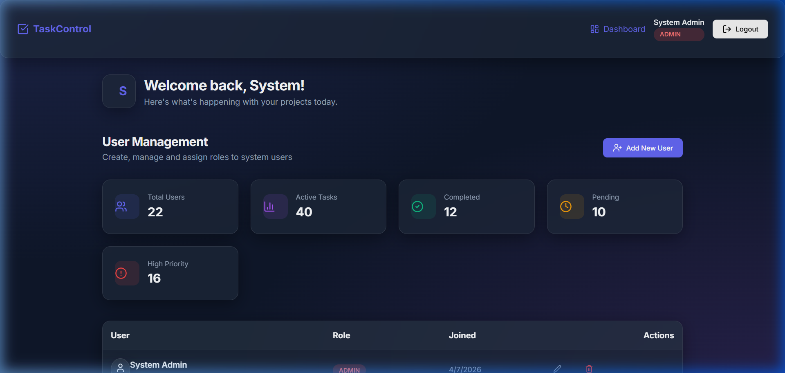
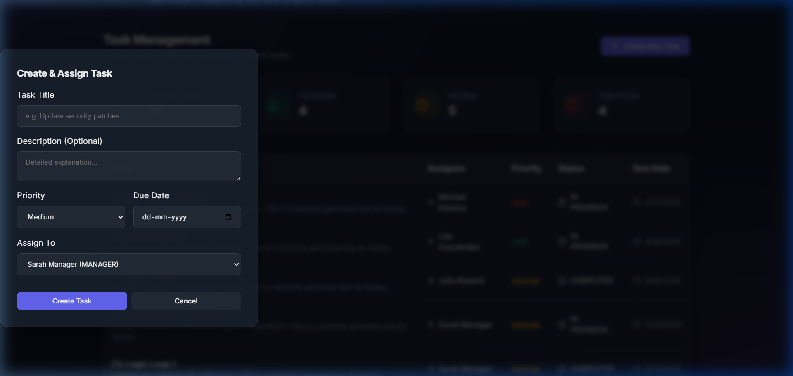
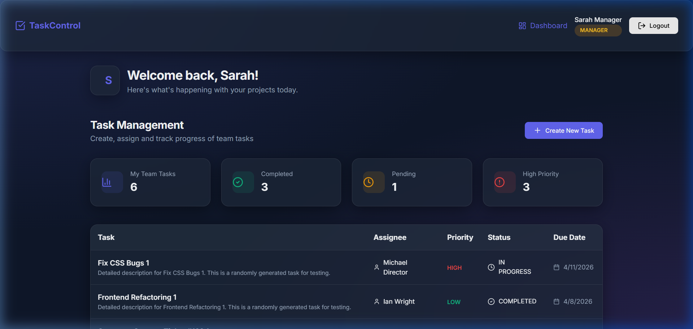

# 🛡️ Secure RBAC Task Management System

<p align="center">
  <b>A modern full-stack Task Management System with Role-Based Access Control (RBAC), secure authentication, and real-time analytics.</b>
</p>

<p align="center">
  
</p>

---

## ✨ Overview

This project is a **production-ready task management application** designed with **security, scalability, and user roles in mind**.

It enables organizations to efficiently manage tasks while maintaining **strict access control** across different user roles.

---

## 🚀 Features

### 🔐 Role-Based Access Control (RBAC)
- **Admin** → Full system control (users + analytics)
- **Manager** → Assign & monitor tasks
- **User** → Track and update assigned tasks

---

### 📊 Analytics Dashboard
- Real-time insights into:
  - Task distribution
  - Priority levels
  - Team productivity
- Clean and interactive UI for better decision-making

---

### 🛡️ Security First
- JWT Authentication (stored in **httpOnly cookies**)
- Password hashing using **bcryptjs**
- Protection against:
  - XSS attacks
  - CSRF attacks

---

### ⚡ Tech Stack

| Layer      | Technology |
|------------|-----------|
| **Frontend** | React (Vite), CSS (Glassmorphism UI), Lucide Icons |
| **Backend**  | Node.js, Express |
| **ORM**      | Prisma 7 |
| **Database** | SQLite (`better-sqlite3`) |

---

## 📂 Project Structure

RBAC-Task-Management-System/
│
├── client/ # React frontend
├── server/ # Node.js backend
├── screenshots/ # UI previews
├── README.md
└── .gitignore


---

## 🛠️ Setup Instructions

### 📦 Prerequisites
- Node.js (v18+)
- npm or yarn

---

### 🔧 Backend Setup

```bash
cd server
npm install
```

Create .env file:
```
DATABASE_URL="file:./dev.db"
JWT_SECRET="your_secret_key"
```


Run:
```
npx prisma generate
npm run seed
npm run dev
```

🎨 Frontend Setup
```
cd client
npm install
npm run dev
```

👥 User Roles

-- Role	Permissions
-- Admin	Manage users, view analytics
-- Manager	Assign tasks, track progress
-- User	Update task status

📸 Screenshots
<p align="center">   </p>


🌐 Deployment
```
**Frontend**
Deploy on Vercel or Netlify
**Backend**
Deploy on Render or Railway
```

**🧠 Key Highlights**
Clean architecture (client/server separation)
Secure authentication flow
Scalable RBAC design
Developer-friendly codebase

** 📝 License**
This project is licensed under the MIT License.


** 💡 Author**
Built with ❤️ for learning, showcasing, and real-world application development.


